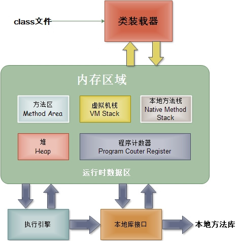

# Run-Time Data Areas - 运行时数据区域

JVM 运行时会有几个运行时数据区域，如下图所示。

## The pc Register - 程序计数器

线程私有内存，保存**当前线程所执行的字节码的行号指示器**，这里和计算机组成原理中的计数器不太一样，计组中的 PC 指的是**下一条要执行的指令**的地址。JVM 中常有多个线程执行，故每条线程都需要有一个独立的程序计数器。

如果线程执行的是 Java 方法，哪儿计数器记录的就是正在执行的虚拟机字节码指令的地址；如果执行的是 Native 方法，这个计数器则为空。

P.S. 这块内存无`OutOfMemoryError`

## Java Virtual Machine Stacks - Java 虚拟机栈

线程私有，虚拟机栈描述的是 Java 方法执行的内存模型，每个方法在执行时会创建一个栈帧，栈帧中保存有局部变量表、操作数栈、动态链接和方法出口等。粗略来讲 Java 内存区分为堆和栈，实际上『栈』指的往往是虚拟机栈中的局部变量表部分。

局部变量表中存放了编译期可知的各种基本数据类型、对象引用类型和 returnAddress 类型。方法运行期间局部变量表大小不变。

## Native Method Stacks - 本地方法栈

和虚拟机栈类似，不过区别在于虚拟机栈为 Java 方法（字节码）服务，而本地方法栈为 Native 方法服务（类似 C 语言中的栈）。具体实现可将这两者合二为一。

## Heap - 堆

堆是被所有线程共享的一块内存区域。一般来说所有的对象实例和数组都要在堆上分配，但一些优化技术导致不一定所有对象实例都在堆上分配。

## Method Area - 方法区

各线程共享的一块内存区域，和操作系统中进程中的『文本段』有些类似，用于存储虚拟机加载的类信息、常量、静态常量和即时编译器编译后的代码数据等。

## Run-Time Constant Pool - 运行时常量池

这一部分是方法区的一部分，用于保存 Class 文件中编译期生成的字面值和符号引用。

## 直接内存

这一部分并不是虚拟机运行时的数据区域，用于 Native 函数分配堆外内存，提高性能用（不必在操作系统堆和 Java 堆复制数据）。

## Reference

- 《深入理解 Java 虚拟机》
- [Java 内存区域详解 - SegmentFault](http://segmentfault.com/a/1190000002931555)
- [Chapter 2. The Structure of the Java Virtual Machine](https://docs.oracle.com/javase/specs/jvms/se7/html/jvms-2.html)
